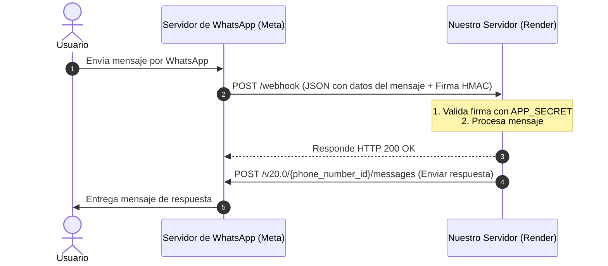

# Análisis de WhatsApp Business Platform y Plan de Implementación para Render

Este documento contiene el análisis del repositorio [whatsapp-business-jaspers-market](https://github.com/fbsamples/whatsapp-business-jaspers-market.git) y un plan detallado para construir y desplegar un aplicativo propio utilizando la **WhatsApp Business Cloud API** con despliegue en **Render**.

---

## 1. Análisis del Repositorio de Referencia (Jasper's Market)

El repositorio de Meta muestra una estructura típica de un bot de WhatsApp interactivo usando **Node.js, Express y Redis**.

### Arquitectura de Archivos y Componentes
*   **`app.js`**: El punto de entrada principal del servidor Express.
    *   Configura el middleware para analizar JSON y URL-encoded.
    *   Implementa la validación de firma digital de Meta (`x-hub-signature-256`) para asegurar que las peticiones provienen genuinamente de WhatsApp.
    *   Expone dos endpoints en la ruta `/webhook`:
        *   `GET /webhook`: Para el proceso de verificación (handshake) inicial con Meta.
        *   `POST /webhook`: Para recibir notificaciones de eventos en tiempo real (mensajes entrantes, cambios de estado como `sent`, `delivered`, `read`).
*   **`services/config.js`**: Carga y valida variables de entorno clave (`ACCESS_TOKEN`, `APP_SECRET`, `VERIFY_TOKEN`, `REDIS_HOST`, `REDIS_PORT`).
*   **`services/graph-api.js`**: Gestiona las llamadas de salida a la API de WhatsApp usando el SDK oficial de Meta (`facebook-nodejs-business-sdk`). Define métodos para enviar:
    *   Respuestas interactivas con botones (`interactive` con tipo `button`).
    *   Mensajes de utilidad basados en plantillas aprobadas (`grocery_delivery_utility`).
    *   Plantillas de oferta por tiempo limitado con códigos de descuento copiables.
    *   Carruseles de tarjetas multimedia.
*   **`services/conversation.js`**: Orquesta la máquina de estados de la conversación. Determina cómo responder basándose en el tipo de mensaje entrante.
*   **`services/redis.js`**: Implementa una base de datos en caché (Redis) para rastrear el ID de los mensajes enviados durante 15 segundos. Si se recibe un estado `delivered` o `read` de un mensaje en la caché, el bot envía un mensaje de seguimiento ("¿Hay algo más en lo que te pueda ayudar?").
*   **`template.sh`**: Script en Bash que descarga imágenes de muestra, las sube a Meta para obtener identificadores multimedia ("handles") y registra las plantillas de mensaje (`message_templates`) directamente en la cuenta de WhatsApp Business del desarrollador.

---

## 2. Funcionamiento Actual de WhatsApp Business Platform (Cloud API)

Para construir un aplicativo moderno y eficiente, es fundamental comprender el flujo de trabajo de la **Cloud API** de WhatsApp:



### Conceptos Clave
1.  **Handshake de Verificación (`GET /webhook`)**:
    Al configurar tu webhook en el panel de Meta, este envía un `GET` a tu servidor con los parámetros `hub.mode=subscribe`, `hub.challenge` (un código aleatorio) y `hub.verify_token` (un token que tú defines). Tu servidor debe verificar que el token coincide y responder directamente con el valor de `hub.challenge`.
2.  **Validación de Firma (`x-hub-signature-256`)**:
    Cada `POST` de Meta incluye una cabecera `x-hub-signature-256` con una firma HMAC-SHA256 del cuerpo crudo de la petición, firmada con el `APP_SECRET` de tu aplicación Meta. Debes recalcular esta firma y verificarla antes de procesar el JSON para evitar peticiones falsas.
3.  **Tipos de Mensajes de Entrada**:
    *   **Mensaje de texto libre**: Contiene la propiedad `body` dentro de `messages[0].text`.
    *   **Mensaje interactivo**: Si el usuario presiona un botón de respuesta rápida (`quick_reply`) o selecciona una opción de lista, llega como un objeto `interactive`.
4.  **Tipos de Mensajes de Salida**:
    *   **Mensaje de sesión (Ventana de 24 horas)**: Si el usuario te escribió en las últimas 24 horas, puedes enviarle cualquier mensaje de texto libre o interactivo sin costo de plantilla.
    *   **Plantillas de mensaje (Templates)**: Fuera de la ventana de 24 horas, solo puedes iniciar conversaciones usando plantillas aprobadas por Meta.

---

## 3. Plan de Construcción para un Aplicativo Propio (Despliegue en Render)

Para facilitar el desarrollo y el mantenimiento en **Render**, simplificaremos la arquitectura de referencia de Meta reemplazando el SDK pesado (`facebook-nodejs-business-sdk`) por llamadas HTTP directas (`fetch` nativo de Node.js). Esto hace que el código sea más legible, rápido de arrancar y consuma menos memoria.

### Paso 1: Configurar el Entorno en Meta Developers
1.  Crea o accede a tu aplicación en [Meta for Developers](https://developers.facebook.com/).
2.  Agrega el producto **WhatsApp** y ve a **Configuración**.
3.  Genera un **Token de acceso temporal** (o uno permanente usando un Usuario del Sistema en el Business Manager).
4.  Identifica tu **Identificador de número de teléfono (Phone Number ID)** y tu **Identificador de cuenta de WhatsApp Business (WABA ID)**.

### Paso 2: Estructura del Proyecto Recomendado
Crearemos un proyecto ligero con Node.js moderno (ES Modules):
```text
mi-whatsapp-bot/
├── src/
│   ├── config.js       # Configuración y variables de entorno
│   ├── webhook.js      # Manejadores de webhook (GET y POST)
│   ├── whatsapp.js     # Cliente API HTTP para enviar mensajes
│   └── app.js          # Servidor Express de entrada
├── .env                # Variables locales (no subir a git)
├── .gitignore
├── package.json
└── README.md
```

---

## 4. Código Base Propuesto para tu Aplicativo

A continuación, tienes una plantilla de código lista para usar que puedes estructurar en tu nuevo repositorio.

### `package.json`
```json
{
  "name": "whatsapp-bot-custom",
  "version": "1.0.0",
  "description": "WhatsApp Bot en Node.js para despliegue en Render",
  "main": "src/app.js",
  "type": "module",
  "scripts": {
    "start": "node src/app.js",
    "dev": "node --watch src/app.js"
  },
  "dependencies": {
    "dotenv": "^16.4.5",
    "express": "^4.19.2"
  }
}
```

### `src/config.js`
```javascript
import dotenv from 'dotenv';
dotenv.config();

export const config = {
  port: process.env.PORT || 10000, // Puerto por defecto en Render
  verifyToken: process.env.VERIFY_TOKEN,
  appSecret: process.env.APP_SECRET,
  accessToken: process.env.ACCESS_TOKEN,
  phoneNumberId: process.env.PHONE_NUMBER_ID,
  apiVersion: process.env.API_VERSION || 'v20.0'
};

// Validar que las variables esenciales existan
export function checkEnv() {
  const required = ['ACCESS_TOKEN', 'VERIFY_TOKEN', 'PHONE_NUMBER_ID'];
  const missing = required.filter(key => !process.env[key]);
  if (missing.length > 0) {
    console.warn(`⚠️ Advertencia: Faltan variables de entorno: ${missing.join(', ')}`);
  }
}
```

### `src/whatsapp.js`
```javascript
import { config } from './config.js';

/**
 * Envía un payload JSON a la API de WhatsApp Cloud
 */
async function sendToWhatsApp(payload) {
  const url = `https://graph.facebook.com/${config.apiVersion}/${config.phoneNumberId}/messages`;
  
  try {
    const response = await fetch(url, {
      method: 'POST',
      headers: {
        'Authorization': `Bearer ${config.accessToken}`,
        'Content-Type': 'application/json',
      },
      body: JSON.stringify(payload)
    });
    
    const data = await response.json();
    if (!response.ok) {
      throw new Error(`WhatsApp API Error: ${JSON.stringify(data)}`);
    }
    return data;
  } catch (error) {
    console.error('Error al enviar mensaje a WhatsApp:', error);
    throw error;
  }
}

/**
 * Envía un mensaje de texto simple
 */
export async function sendTextMessage(to, text) {
  const payload = {
    messaging_product: 'whatsapp',
    recipient_type: 'individual',
    to: to,
    type: 'text',
    text: { body: text }
  };
  return sendToWhatsApp(payload);
}

/**
 * Envía botones interactivos (Respuesta rápida)
 * Máximo 3 botones permitidos por WhatsApp en este formato
 */
export async function sendButtonsMessage(to, bodyText, buttons) {
  // buttons: [{ id: 'btn_1', title: 'Opción 1' }]
  const payload = {
    messaging_product: 'whatsapp',
    recipient_type: 'individual',
    to: to,
    type: 'interactive',
    interactive: {
      type: 'button',
      body: { text: bodyText },
      action: {
        buttons: buttons.map(btn => ({
          type: 'reply',
          reply: { id: btn.id, title: btn.title }
        }))
      }
    }
  };
  return sendToWhatsApp(payload);
}
```

### `src/webhook.js`
```javascript
import crypto from 'crypto';
import { config } from './config.js';
import { sendTextMessage, sendButtonsMessage } from './whatsapp.js';

// Verificación del Webhook (Handshake con Meta)
export function handleVerification(req, res) {
  const mode = req.query['hub.mode'];
  const token = req.query['hub.verify_token'];
  const challenge = req.query['hub.challenge'];

  if (mode === 'subscribe' && token === config.verifyToken) {
    console.log('✅ Webhook verificado correctamente.');
    res.status(200).send(challenge);
  } else {
    console.warn('❌ Token de verificación inválido.');
    res.sendStatus(403);
  }
}

// Middleware para validar la firma de Meta
export function verifySignature(req, res, buf, encoding) {
  const signature = req.headers['x-hub-signature-256'];
  if (!signature) {
    console.warn('Falta firma x-hub-signature-256 en cabeceras.');
    return;
  }

  const elements = signature.split('=');
  const signatureHash = elements[1];
  
  const expectedHash = crypto
    .createHmac('sha256', config.appSecret || '')
    .update(buf)
    .digest('hex');

  if (signatureHash !== expectedHash) {
    throw new Error('No se pudo validar la firma de la petición.');
  }
}

// Procesar eventos entrantes
export async function handleWebhookEvent(req, res) {
  const body = req.body;

  if (body.object === 'whatsapp_business_account') {
    for (const entry of body.entry) {
      for (const change of entry.changes) {
        const value = change.value;
        if (!value) continue;

        // 1. Manejar Mensajes Entrantes
        if (value.messages) {
          for (const message of value.messages) {
            const from = message.from; // Número de teléfono del usuario
            const messageId = message.id;

            console.log(`Mensaje recibido de ${from}:`, message);

            if (message.type === 'text') {
              const textBody = message.text.body.toLowerCase().trim();

              if (textBody === 'hola' || textBody === 'menu') {
                await sendButtonsMessage(from, '¡Hola! ¿Cómo te puedo ayudar hoy?', [
                  { id: 'opt_servicios', title: 'Ver servicios 🛠️' },
                  { id: 'opt_contacto', title: 'Contacto humano 🧑‍💼' }
                ]);
              } else {
                await sendTextMessage(from, `Escribiste: "${message.text.body}". Escribe "hola" o "menu" para ver opciones.`);
              }
            } else if (message.type === 'interactive') {
              // Respuesta a los botones interactivos
              const buttonId = message.interactive.button_reply.id;
              
              if (buttonId === 'opt_servicios') {
                await sendTextMessage(from, 'Ofrecemos desarrollo de software a medida y bots para WhatsApp.');
              } else if (buttonId === 'opt_contacto') {
                await sendTextMessage(from, 'Un agente se pondrá en contacto contigo pronto.');
              }
            }
          }
        }

        // 2. Manejar Actualizaciones de Estado (sent, delivered, read, failed)
        if (value.statuses) {
          for (const status of value.statuses) {
            console.log(`Estado del mensaje ${status.id}: ${status.status} (usuario: ${status.recipient_id})`);
          }
        }
      }
    }
    res.status(200).send('EVENT_RECEIVED');
  } else {
    res.sendStatus(404);
  }
}
```

### `src/app.js`
```javascript
import express from 'express';
import { config, checkEnv } from './config.js';
import { handleVerification, handleWebhookEvent, verifySignature } from './webhook.js';

const app = express();

// Parsear cuerpo crudo para validar la firma digital de Meta
app.use(express.json({
  verify: verifySignature
}));

app.use(express.urlencoded({ extended: true }));

// Rutas del Webhook
app.get('/webhook', handleVerification);
app.post('/webhook', handleWebhookEvent);

// Ruta de diagnóstico / salud
app.get('/', (req, res) => {
  res.json({ status: 'online', service: 'WhatsApp Custom Bot' });
});

checkEnv();

app.listen(config.port, () => {
  console.log(`🚀 Servidor escuchando en el puerto ${config.port}`);
});
```

---

## 5. Proceso de Despliegue en Render (Paso a Paso)

Render es excelente para alojar este tipo de Web Services en Node.js de forma gratuita o de muy bajo costo.

### Paso 1: Subir tu Código a GitHub
Crea un repositorio en GitHub (público o privado) y sube la estructura de código base propuesta anteriormente.

### Paso 2: Crear el Web Service en Render
1.  Inicia sesión en [Render Dashboard](https://dashboard.render.com/).
2.  Haz clic en **New +** y selecciona **Web Service**.
3.  Conecta tu cuenta de GitHub y selecciona el repositorio que acabas de crear.
4.  Configura los detalles del servicio:
    *   **Name**: `whatsapp-bot-mi-aplicativo` (o el nombre que elijas)
    *   **Environment**: `Node`
    *   **Build Command**: `npm install`
    *   **Start Command**: `npm start`
    *   **Instance Type**: `Free` (suficiente para desarrollo)

### Paso 3: Configurar Variables de Entorno en Render
En la pestaña **Environment** de tu Web Service en Render, añade las siguientes variables clave:

| Variable | Valor / Origen | ¿Requerida? |
| :--- | :--- | :--- |
| `PORT` | `10000` (Render asignará uno automáticamente, pero puedes forzarlo si quieres) | Opcional |
| `ACCESS_TOKEN` | Token de acceso (permanente o temporal) obtenido de Meta Developers | **Sí** |
| `VERIFY_TOKEN` | Una frase secreta alfanumérica inventada por ti (ej: `MiSecretoSuperSeguro123!`) | **Sí** |
| `PHONE_NUMBER_ID` | Identificador de número de teléfono de WhatsApp en el panel de Meta | **Sí** |
| `APP_SECRET` | Secreto de la aplicación de Meta Developers (sección Ajustes Básicos) | Opcional (Recomendado para producción para validar firma `verifySignature`) |

### Paso 4: Configurar la URL en Meta Developers
1.  Una vez que Render termine de desplegar (verás el mensaje `🚀 Servidor escuchando...` en los logs de Render), copia la URL pública de tu aplicación (por ejemplo: `https://whatsapp-bot-mi-aplicativo.onrender.com`).
2.  Ve al panel de **Meta Developers > WhatsApp > Configuración**.
3.  En la sección de **Webhooks**, haz clic en **Editar**.
4.  Pega tu URL agregando el endpoint de webhook al final: `https://whatsapp-bot-mi-aplicativo.onrender.com/webhook`.
5.  En **Token de verificación**, introduce la misma clave que configuraste en `VERIFY_TOKEN` de Render.
6.  Haz clic en **Guardar y Verificar**. Meta realizará una llamada `GET` instantánea a tu webhook para validarlo.
7.  **¡IMPORTANTE!** En la misma pantalla de configuración del webhook, haz clic en **Administrar** al lado de los campos de webhook y asegúrate de **Suscribirte al campo `messages`**. Si no haces esto, WhatsApp no enviará los mensajes entrantes a tu servidor.

---

## 6. Siguientes Pasos de Desarrollo
Una vez que el webhook esté configurado en Meta:
1.  **Prueba inicial**: Envía un mensaje con la palabra "hola" al número de teléfono de prueba de WhatsApp asignado en tu panel de Meta. Deberías recibir un mensaje interactivo con dos botones.
2.  **Base de Datos**: Si necesitas persistencia (guardar historial de conversaciones, estados de flujos complejos o datos del cliente), puedes añadir un servicio gratuito de **PostgreSQL** directamente en Render y conectarlo a tu app Express usando `pg` o un ORM como Prisma.
3.  **Plantillas de Inicio**: Si deseas iniciar la conversación de forma proactiva con un usuario después de que hayan pasado más de 24 horas, deberás crear una plantilla desde el panel de WhatsApp Manager y enviar el payload con formato `type: "template"` en lugar de `type: "text"`.
